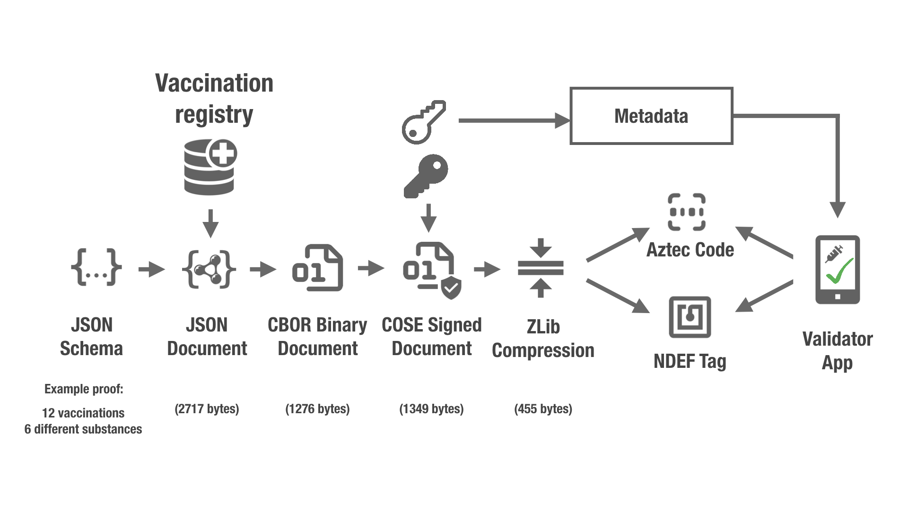

[![CC BY 4.0][cc-by-shield]][cc-by]

# Vaccination Proof

This repository contains a proposal for encoding and signing health certificates, as a candidate to be adapted and adopted by eHealth authorities as they seem fit.

## Installation

    poetry shell
    poetry install

## Test

    poetry run make test

## Data Format

The hCert is represented using CBOR Web Token (CWT) as defined [RFC 8392](https://tools.ietf.org/html/rfc8392). The hCert payload is transported in a hCert claim (the claim key to be used to identify this claim is yet to be determined).

Before transport, the hCert is compressed using ZLIB ([RFC1950](https://tools.ietf.org/html/rfc1950)).

## Overview

# Presentation

[A short presentation on the background of this initative is available](hcert-preso.pdf)).

# Specification

[A draft specification is available](hcert_spec.md).

# Contributions

Contributions are very welcome - please file a pull request.

_________________

This work is licensed under a
[Creative Commons Attribution 4.0 International License][cc-by].

[![CC BY 4.0][cc-by-image]][cc-by]

[cc-by]: http://creativecommons.org/licenses/by/4.0/
[cc-by-image]: https://i.creativecommons.org/l/by/4.0/88x31.png
[cc-by-shield]: https://img.shields.io/badge/License-CC%20BY%204.0-lightgrey.svg
