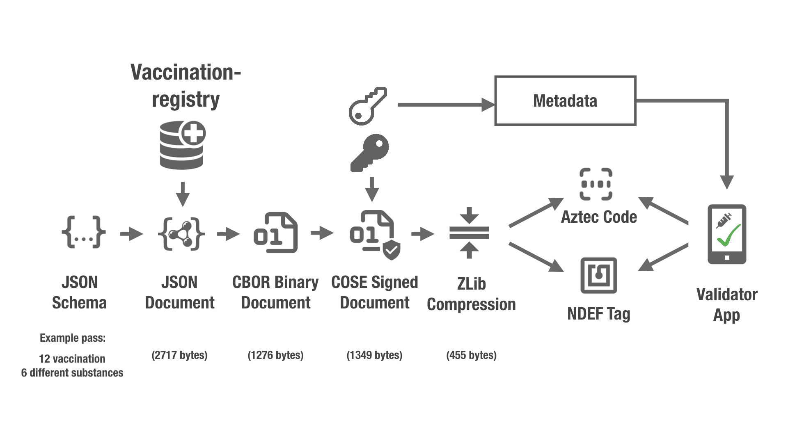

# Vaccination Proof

This repository contains a proposal for encoding and signing proof of vaccination, as a candidate to be adapted and adopted by eHealth authorities as they seem fit.

## Installation

    poetry shell
    poetry install

## Test

    poetry run make test

## Data Format

Vaccination proofs are encoded as CBOR ([RFC7049](https://tools.ietf.org/html/rfc7049)) and signed using COSE ([RFC8152](https://tools.ietf.org/html/rfc8152)), and then compressed using ZLIB ([RFC1950](https://tools.ietf.org/html/rfc1950)).

## Overview

# Presentation

A short presentation on the background of this initative is available ([here](vproof-preso.pdf)).

# Specification

A draft specification is available ([here](vproof_spec.md)).

# Contributions

Contributions are very welcome. Please file a pull request.

_________________

Shield: [![CC BY 4.0][cc-by-shield]][cc-by]

This work is licensed under a
[Creative Commons Attribution 4.0 International License][cc-by].

[![CC BY 4.0][cc-by-image]][cc-by]

[cc-by]: http://creativecommons.org/licenses/by/4.0/
[cc-by-image]: https://i.creativecommons.org/l/by/4.0/88x31.png
[cc-by-shield]: https://img.shields.io/badge/License-CC%20BY%204.0-lightgrey.svg
